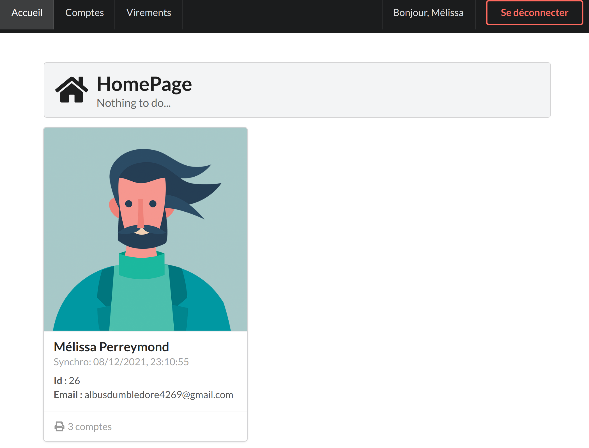
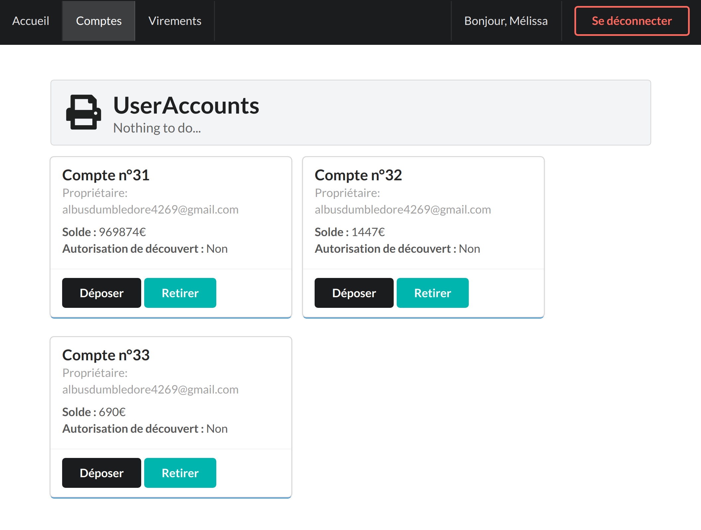
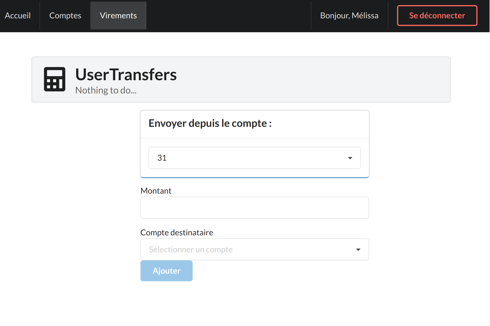
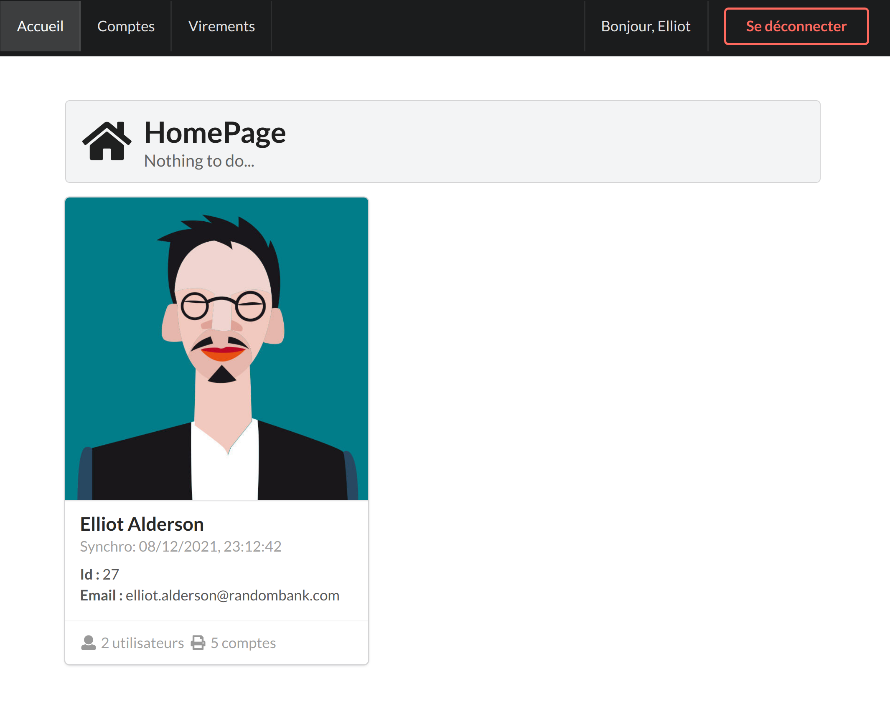
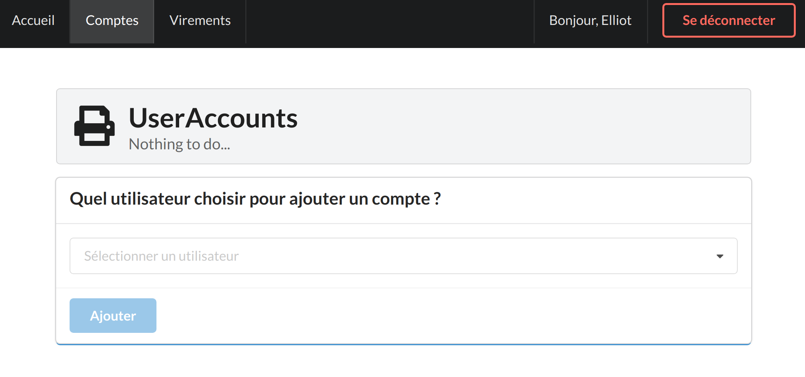
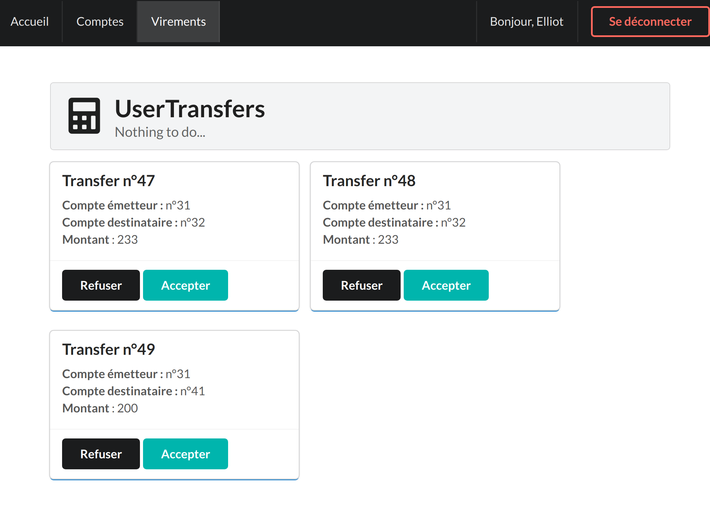

**Binome** : Mélissa Perreymond & Samy Djama <br>
Le github de Samy : https://github.com/domtox/app_bank_projet_2021

# appbank : Une application bancaire fullstack sping-boot / react / keycloak


Il s'agit d'un projet universitaire en binôme dont le but est de fournir une API back d'application bancaire à un frontend. 

`appbank` est constituée d'un **Spring-Boot** Rest API `appbank-api `, et d'un frontend en **ReactJS**  `appbank-webui` sécurisé avec **keycloak**. La base de donnée utilisée pour l'API backend et celle de keycloak est **MySql**. La gestion de la base de donnée de l'API peut être faite depuis **adminer**.

Les ports utilisés sont : 8000, 8080, 9000 et 3000. Veuillez à ce qu'aucun de ces ports ne soient utilisés.

## Prérequis

- `Java 11.0.11`
- `Tomcat 9.0.54`
- `Maven 3.6.3`
- `Node 14.18.1`
- `npm 6.14.15`
- `Docker 20.10.7` 
- `Docker-Compose 1.25.0`

## Lancer l'environnement

- Ouvrir le terminal et aller au dossier appbank 
- Lancer le script de démarrage  :
```
$./start.sh
``` 
Ce script lancera la base de donnée de l'API Rest et celle de keycloak. 

## Initialiser keycloak
Si vous n'avez jamais utilisé ce projet, il vous faudra pour le premier lancement initaliser keycloak. Pour se faire, aller à l'adresse ``http://localhost:8000``. Si vous venez de lancer le script start.sh, il se peut que vous devez attendre quelques secondes avant de voir l'interface de keycloak.

Une fois la page ouverte, aller dans ``administration console``, et s'authentifier avec :
- **Username** : admin
- **Password** : admin

Mettre le curseur sur ``master``. Il devrait apparaître l'option ``add realms``. Ajouter le realms "**appbank**", puis appuyer sur ``create``.

Afin d'importer les différents rôles, un fichier realm-export.json est inclu dans le dossier appbank. Sur Keycloak, cliquer donc sur ``import`` -> ``select file`` -> puis sélectinner le fichier **realm-export.json**. Dans ``if resource exists``, appuyer sur ``skip``. Finaliser l'import en cliquant sur import. 

Pour l'identity provider, aller dans ``indentity provider``, puis github. Le client secret sera à copier. 

> **CLIENT SECRET : 868357bd5cd2edb17b798ea24e155a96c6045fb5**

Puis, il faudra cliquer sur ``save``.

La base de données de keycloak sera initialement vide. Pour tester, vous devriez au moins créer un utilisateur administrateur, et un client. Pour se faire, aller dans ``users`` puis ``create user``. Le role de l'admin sera ``appbank-admin`` et celui du client sera ``default-roles-appbank``. 

Vous pouvez à tout moment modifier vos users dans l'onglet ``users``, puis en cliquant sur ``view all users``. Vous pourrez alors éditer tous vos utilisateurs déjà crées.

## Exécuter appbank avec Maven & Npm

**appbank-api**
- Ouvrir le terminal et aller au dossier appbank/appbank-api
- Lancer la commande **maven** : 
```
$./mvnw spring-boot:run
```
**appbank-webui**
- Ouvrir le terminal et aller au dossier appbank/appbank-webui
- Si c'est la première fois que vous exécutez appbank-webui, lancez la commande **npm**:
```
$npm i
```
- Lancer la commande **npm**:
```
$npm start run
```
## Stopper l'environnement

- Ouvrir le terminal et aller au dossier appbank 
- Lancer le script de démarrage  :
```
$./stop.sh
```
- Vous pouvez vérifier que le stop s'est bien passé en lançant la commande dans ce même dossier : 
```
$docker ps -a
```
- L'affichage ne devrait afficher **aucun** container :
```
CONTAINER ID   IMAGE     COMMAND   CREATED   STATUS    PORTS     NAMES
```
- Si ce n'est pas le cas, vous pouvez toujours lancer la commande :
```
$docker system prune
``` 

/!\ Cependant, la commande entraînera la **suppression des données que manipule l'API** /!\

## Adminer
Adminer permet de visualiser et gérer la base de données de l'API. On y accède avec l'adresse  ``http://localhost:9000``
L'authentification se fait avec : 
- **Système** : MySQL
- **Serveur** : mysql-appbank
- **Utilisateur**: melissa
- **Mot de passe** : changeme
- **Base de données** : appbank

Toutes ces données peuvent être modifiés et personnaliser dans le fichier ``appbank/docker-compose.yaml``.

## Keycloak 
La base de données de keycloak utilisé pour l'authentification est accessible depuis l'adresse  ``http://localhost:8000``.

L'authentification se fait depuis ``Administration Console`` avec :
- **Username** : admin
- **Password** : admin

## Interface utilisateur
Le site web est accessible depuis l'adresse ``http.//localhost:3000``. Afin d'accéder aux différents services, vous devez vous authentifier en tant qu'utilisateur client ou administrateur. Veuillez alors vous reporter à la base de donnée utilisateur dans keycloak, accessible depuis ``administration console``. Pour y accéder, veuillez vous authentifier, puis dans le menu latérale gauche, cliquez sur ``users``, puis ``View all users``.

## Vue utilisateur


- Dans son **home**, l'utilisateur voit son nom, son adresse mail, et le nombre de comptes qu'il possède.



- Dans l'onglet **compte**, l'utilisateur peut retirer et déposer de l'argent sur ses comptes. Les retraits ne sont un succès que s'il a le droit de retirer, i.e. qu'il ne retire pas plus d'argent qu'il n'en ai, à moins que l'administrateur lui ait autorisé sur son compte d'être à découvert. Le solde est mis à jour (toutefois, il faut réactualiser la page pour visualiser le changement, problème sur le react). 



- Dans l'onglet **virement**, l'utilisateur peut envoyer de l'argent depuis l'un de ses comptes vers l'un des comptes de la banque (dont les siens). Le virement est alors mis en attente et doit être validé par l'administrateur.



## Vue administrateur
- Dans son **home**, l'administrateur voit son nom, le nombre d'utilisateurs et de comptes sur la banque. L'administrateur n'a pas de compte à la banque. 



- Dans l'onglet **compte**, l'administrateur peut ajouter des comptes aux utilisateurs. 



- Dans l'onglet **virement**, l’administrateur a accès à la liste des virements en attente de validation. Il peut alors accepter ou refuser le virement. Après sa décision, le virement sera supprimé de la liste en attente. En cas d'**acceptation**, les soldes du compte émetteur et destinataire sont mis à jour dans la condition où l'émetteur a effectivement le droit de retirer. 




